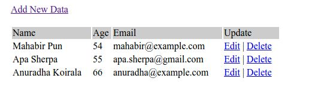

# Membuat_CRUD_PHP_MYSQL

## CRUD PHP MYSQL
Welcome my to tutorial

### Ini adalah spoiler bagaimana cara Membuat Crud Php Mysql


<p align="center">
 
</p>
<p align="center">
<a href="https://github.com/akmalabdilah"></a>
<p align="center">

<p align="center">
<a href="https://github.com/akmalabdilah/Membuat_CRUD_PHP_MYSQL.git">Requirements</a> •
<a href="https://github.com/akmalabdilah/Membuat_CRUD_PHP_MYSQL.git">Informasi</a> •
<a href="https://github.com/akmalabdilah/Membuat_CRUD_PHP_MYSQL.git">Tutorial</a>
</p>
</div>

# Requirements
- [Jupyter Notebook](https://git-scm.com/download)

# Informasi CRUD dalam PHP
Apa itu CRUD PHP?
<p>
CRUD adalah singkatan dari Create, Read, Update, dan Delete. Ini adalah operasi dasar yang umum dilakukan pada basis data atau sistem manajemen basis data (DBMS) untuk mengelola data. CRUD PHP mengacu pada implementasi operasi CRUD menggunakan bahasa pemrograman PHP.

- Create (Membuat): Operasi Create digunakan untuk membuat data baru dalam basis data. Dalam konteks PHP, ini melibatkan pengambilan data dari formulir atau sumber input lainnya, memvalidasi dan memproses data tersebut, lalu menyimpannya dalam basis data.

- Read (Membaca): Operasi Read digunakan untuk membaca atau mengambil data dari basis data. Dalam PHP, ini melibatkan mengeksekusi query SQL yang sesuai untuk mengambil data yang diinginkan dari tabel atau sumber data lainnya. Data yang diperoleh kemudian dapat ditampilkan di halaman web atau digunakan untuk tujuan lainnya.

- Update (Memperbarui): Operasi Update digunakan untuk memperbarui data yang ada dalam basis data. Dalam PHP, ini melibatkan mengambil data yang sudah ada, memodifikasinya berdasarkan perubahan yang diinginkan, dan menyimpan kembali perubahan tersebut ke dalam basis data.

- Delete (Menghapus): Operasi Delete digunakan untuk menghapus data dari basis data. Dalam PHP, ini melibatkan mengeksekusi query SQL yang sesuai untuk menghapus data yang diinginkan dari tabel atau sumber data lainnya.

CRUD PHP sering digunakan dalam pengembangan aplikasi web yang melibatkan interaksi dengan basis data. Dalam implementasinya, PHP dapat menggunakan ekstensi atau library seperti MySQLi atau PDO (PHP Data Objects) untuk berinteraksi dengan basis data secara efisien dan aman. Dengan menggunakan operasi CRUD, pengembang dapat memanipulasi data dalam basis data dengan mudah dan memastikan integritas data yang baik.
</p>

# Tutorial
- Berikut adalah panduan langkah demi langkah untuk membuat sistem CRUD menggunakan PHP & MySQL:

- 0. Pertama-tama, kita akan membuat database MySQL baru. Mari kita beri nama database sebagai ' test '.


```sql
CREATE DATABASE test;
```


- 1. Kemudian, kita akan membuat tabel baru di database 'test'. Mari kita beri nama tabel sebagai ' pengguna '.


```sql
use test;

CREATE TABLE `users` (
  `id` int(11) NOT NULL auto_increment,
  `name` varchar(100) NOT NULL,
  `age` int(3) NOT NULL,
  `email` varchar(100) NOT NULL,
  PRIMARY KEY  (`id`)
);
```

- 2. Sekarang, kita akan membuat file config.php yang berisi kode koneksi database. Kode ini terhubung ke database MySQL. File ini disertakan di semua halaman PHP yang membutuhkan koneksi database.

- dbConnection.php

- Dalam kode di bawah ini, nama host basis data adalah localhostwhere username=rootdan password=root. Basis data testtelah dipilih.


```php
 <?php
$databaseHost = 'localhost';
$databaseName = 'test';
$databaseUsername = 'root';
$databasePassword = 'root';

// Open a new connection to the MySQL server
$mysqli = mysqli_connect($databaseHost, $databaseUsername, $databasePassword, $databaseName);
`

```


- 3. Untuk menambahkan data ke database, kita memerlukan formulir html.

- tambahkan.php


```php
 <html>
<head>
	<title>Add Data</title>
</head>

<body>
	<h2>Add Data</h2>
	<p>
		<a href="index.php">Home</a>
	</p>

	<form action="addAction.php" method="post" name="add">
		<table width="25%" border="0">
			<tr> 
				<td>Name</td>
				<td><input type="text" name="name"></td>
			</tr>
			<tr> 
				<td>Age</td>
				<td><input type="text" name="age"></td>
			</tr>
			<tr> 
				<td>Email</td>
				<td><input type="text" name="email"></td>
			</tr>
			<tr> 
				<td></td>
				<td><input type="submit" name="submit" value="Add"></td>
			</tr>
		</table>
	</form>
</body>
</html>
```

- 4. Bentuk tindakan pada add.phpadalah addAction.php. Artinya data formulir yang dikirimkan akan masuk ke addAction.php.

- Di addAction.php, kami melakukan validasi sederhana untuk memeriksa apakah nama, email & usia yang dimasukkan kosong atau tidak. Jika sudah terisi semua maka data akan dimasukkan ke dalam tabel database.

- addAction.php


```php
<html>
<head>
	<title>Add Data</title>
</head>

<body>
<?php
// Include the database connection file
require_once("dbConnection.php");

if (isset($_POST['submit'])) {
	// Escape special characters in string for use in SQL statement	
	$name = mysqli_real_escape_string($mysqli, $_POST['name']);
	$age = mysqli_real_escape_string($mysqli, $_POST['age']);
	$email = mysqli_real_escape_string($mysqli, $_POST['email']);
		
	// Check for empty fields
	if (empty($name) || empty($age) || empty($email)) {
		if (empty($name)) {
			echo "<font color='red'>Name field is empty.</font><br/>";
		}
		
		if (empty($age)) {
			echo "<font color='red'>Age field is empty.</font><br/>";
		}
		
		if (empty($email)) {
			echo "<font color='red'>Email field is empty.</font><br/>";
		}
		
		// Show link to the previous page
		echo "<br/><a href='javascript:self.history.back();'>Go Back</a>";
	} else { 
		// If all the fields are filled (not empty) 

		// Insert data into database
		$result = mysqli_query($mysqli, "INSERT INTO users (`name`, `age`, `email`) VALUES ('$name', '$age', '$email')");
		
		// Display success message
		echo "<p><font color='green'>Data added successfully!</p>";
		echo "<a href='index.php'>View Result</a>";
	}
}
?>
</body>
</html>

```

- 6. Data dari database diambil dan ditampilkan dalam index.phpfile. Ini adalah beranda kami. File ini juga berisi tautan untuk menambahkan data. Pada setiap baris data yang ditampilkan juga terdapat link untuk mengedit dan menghapus data. Di bawah ini adalah contoh gambar beranda kami:



- index.php

```php
 <?php
// Include the database connection file
require_once("dbConnection.php");

// Fetch data in descending order (lastest entry first)
$result = mysqli_query($mysqli, "SELECT * FROM users ORDER BY id DESC");
?>

<html>
<head>	
	<title>Homepage</title>
</head>

<body>
	<h2>Homepage</h2>
	<p>
		<a href="add.php">Add New Data</a>
	</p>
	<table width='80%' border=0>
		<tr bgcolor='#DDDDDD'>
			<td><strong>Name</strong></td>
			<td><strong>Age</strong></td>
			<td><strong>Email</strong></td>
			<td><strong>Action</strong></td>
		</tr>
		<?php
		// Fetch the next row of a result set as an associative array
		while ($res = mysqli_fetch_assoc($result)) {
			echo "<tr>";
			echo "<td>".$res['name']."</td>";
			echo "<td>".$res['age']."</td>";
			echo "<td>".$res['email']."</td>";	
			echo "<td><a href=\"edit.php?id=$res[id]\">Edit</a> | 
			<a href=\"delete.php?id=$res[id]\" onClick=\"return confirm('Are you sure you want to delete?')\">Delete</a></td>";
		}
		?>
	</table>
</body>
</html>
```

- 7. Setiap baris data dapat diedit secara terpisah. ID baris dilewatkan dalam URL edit.php. ID secara unik mengidentifikasi entri data.

- Tindakan dari bentuk di edit.phpadalah editAction.php. Artinya data formulir yang dikirimkan akan masuk ke editAction.php.

- Di edit.php, entri data baris tunggal diambil berdasarkan id. Data yang diambil ditampilkan dalam formulir edit. Saat pengguna mengedit data dan mengirimkan formulir, data formulir yang dikirimkan masuk ke editAction.php.


- edit.php

```php
 <?php
// Include the database connection file
require_once("dbConnection.php");

// Get id from URL parameter
$id = $_GET['id'];

// Select data associated with this particular id
$result = mysqli_query($mysqli, "SELECT * FROM users WHERE id = $id");

// Fetch the next row of a result set as an associative array
$resultData = mysqli_fetch_assoc($result);

$name = $resultData['name'];
$age = $resultData['age'];
$email = $resultData['email'];
?>
<html>
<head>	
	<title>Edit Data</title>
</head>

<body>
    <h2>Edit Data</h2>
    <p>
	    <a href="index.php">Home</a>
    </p>
	
	<form name="edit" method="post" action="editAction.php">
		<table border="0">
			<tr> 
				<td>Name</td>
				<td><input type="text" name="name" value="<?php echo $name; ?>"></td>
			</tr>
			<tr> 
				<td>Age</td>
				<td><input type="text" name="age" value="<?php echo $age; ?>"></td>
			</tr>
			<tr> 
				<td>Email</td>
				<td><input type="text" name="email" value="<?php echo $email; ?>"></td>
			</tr>
			<tr>
				<td><input type="hidden" name="id" value=<?php echo $id; ?>></td>
				<td><input type="submit" name="update" value="Update"></td>
			</tr>
		</table>
	</form>
</body>
</html>

```

- 8. Dalam editAction.phpbeberapa validasi sederhana dilakukan untuk data kosong. Ketika semuanya sudah benar, maka entri data tertentu itu diperbarui dalam database.

- editAction.php


```php
 <?php
// Include the database connection file
require_once("dbConnection.php");

if (isset($_POST['update'])) {
	// Escape special characters in a string for use in an SQL statement
	$id = mysqli_real_escape_string($mysqli, $_POST['id']);
	$name = mysqli_real_escape_string($mysqli, $_POST['name']);
	$age = mysqli_real_escape_string($mysqli, $_POST['age']);
	$email = mysqli_real_escape_string($mysqli, $_POST['email']);	
	
	// Check for empty fields
	if (empty($name) || empty($age) || empty($email)) {
		if (empty($name)) {
			echo "<font color='red'>Name field is empty.</font><br/>";
		}
		
		if (empty($age)) {
			echo "<font color='red'>Age field is empty.</font><br/>";
		}
		
		if (empty($email)) {
			echo "<font color='red'>Email field is empty.</font><br/>";
		}
	} else {
		// Update the database table
		$result = mysqli_query($mysqli, "UPDATE users SET `name` = '$name', `age` = '$age', `email` = '$email' WHERE `id` = $id");
		
		// Display success message
		echo "<p><font color='green'>Data updated successfully!</p>";
		echo "<a href='index.php'>View Result</a>";
	}
}

```

- 9. Setiap baris data dapat dihapus secara terpisah. ID baris dilewatkan dalam URL delete.php. ID secara unik mengidentifikasi entri data. Setelah dihapus, pengguna dialihkan ke beranda ( index.php).

- hapus.php


```php
 <?php
// Include the database connection file
require_once("dbConnection.php");

// Get id parameter value from URL
$id = $_GET['id'];

// Delete row from the database table
$result = mysqli_query($mysqli, "DELETE FROM users WHERE id = $id");

// Redirect to the main display page (index.php in our case)
header("Location:index.php");
`

```


<p align="center">
<a href="https://blog.chapagain.com.np/very-simple-add-edit-delete-view-in-php-mysql/">Sumber Refrensi</a>
</p>
</div>

- Oke mungkin segitu saja tutorial dari saya mengenai cara Membuat CRUD PHP dengan MYSQL nanti jika saya lagi gabut lagi saya akan memberikan tutorial kedua cara menggunakan PHP, MSQL,dan FREMORK.

- Selesai


<div>
<h2 align="center">Thanks For Reading!!!</h2>
<div align="center">
